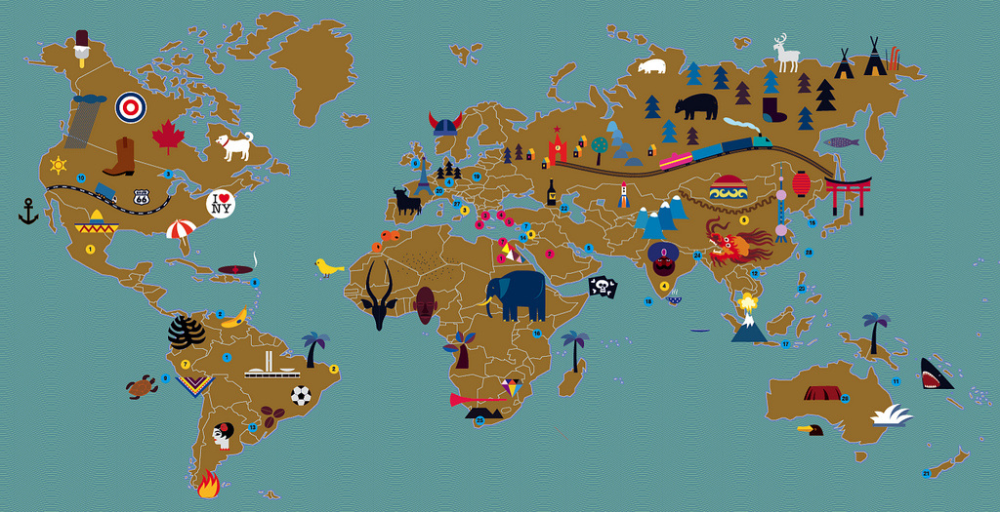

# nerdcator
[session] mapping nerdy places at Mozfest

*[World map](http://farm8.staticflickr.com/7123/7105972961_c17a3f75f6_b.jpg) by Maria Zaikina, available under a Creative Commons Attribution License 2.0*

## description

Although there are innumerable travel maps, books, and apps for places to see around the world, there are few such resources for scientist/nerd travelers. With Nerdcator we want to create an open data repository that collects such places in a crowdsourced manner, creating a global community of fellow scientist/nerds. We will demonstrate a basic app that allows travelers to find nearby sites of special interest to scientists/nerds such as geological/botanical features, offbeat museums, graves of our scientific heroes, locations of historic/scientific events, and even research labs offering tours. 

We want attendees to design the next iteration of the app, to refine the social and technological features that will enable Nerdcator to succeed where other such efforts (e.g., nerdydaytrips.com) have failed to take off. Participants can also test the app after festival hours with sites such as the Greenwich meridian line, the Cutty Sark clipper ship, or astronomer Frank Dyson’s home.

* `tools/` - various approaches in making a map app like this using some open source tools
* `sources/` - ideas on where you can get data to populate a map app
* `data/` - actual data entry points to get you started making your own nerdy app

## data + location

## facilitators

* Bastian Greshake, OpenSNP, [@gedankenstuecke](https://twitter.com/gedankenstuecke)
* Aurelia Moser, Mozilla Science Lab, [@auremoser](https://twitter.com/auremoser)
* Egle Marija Ramanauskaite, EpiCollect, [@seplute](https://twitter.com/seplute)
* Sujai Kumar, Edinburgh University, [@sujaik](https://twitter.com/sujaik)

## session structure

### Talking part:

Goal: to create a shared map for nerd travel (but the template can be used for any other kind of travel/shared interest)

Methods: (divided into three main parts)

1. Collecting data (different ways of doing this - using Google Forms, EpiCollect, WikiVoyage). Ideally show one city each
2. Displaying data (Carto, EpiCollect, OSM). Ideally in a browser, or on a smartphone

### Doing part:

1. Ask attendees to sign in (and let us know if they want updates on the project)
2. Encourage everyone to enter their favourite nerd travel recommendations, and to suggest sources for other nerd travel that we could scrape
3. Talk about curating data (do we need this section?). What curation model works? Authorised users?
4. Get feedback on what everyone thinks is the best way to enter/curate/view data out of the options on offer, or any others that are recommended

### Wrap up:

1. Decide next steps (based on attendee feedback)
2. Make sure everyone knows where the repo lives
3. Handouts (stickers/?)

## links

* session in the [Mozfest 2016 schedule](https://app.mozillafestival.org/#_session-443)

